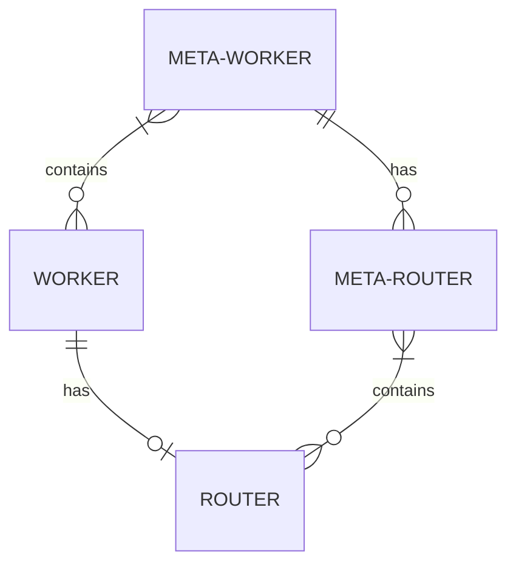

# Mafalda

Scalable SFU based on Mediasoup

`Mafalda` is a wrapper on top of [Mediasoup](https://mediasoup.org/) SFU focused
on provide an easier API by managing itself all the performance and scalability
issues by default, including multi-machine clustering.

Name of the project has been taken as a tribute to
[Mafalda](https://en.wikipedia.org/wiki/Mafalda), the character created by
Joaquín Salvador Lavado Tejón '[Quino](https://www.quino.com.ar/homequino)',
that has a love-hate relationship with both *mass media* and soup ;-)

It's designed having in mind high scale one-to-many WebRTC-based
videoconferences, but it's possible to use it with any kind of WebRTC-based
application including many-to-many videocalls, specially when they are designed
as many one-to-many ones.

## Features

- 100% acceptance tests code coverage for both lines, branches statements and
  functions
- Optimiced resources consumption on half-used machines
- Simple to use API following Mediasoup API design
- Fully automated
  [vertical](https://en.wikipedia.org/wiki/Scalability#Vertical_or_scale_up)
  and
  [horizontal](https://en.wikipedia.org/wiki/Scalability#Horizontal_or_scale_out)
  scaling, in a transparent and seamless way for both users and developers

## Installation

```sh
npm install --save mafalda*.tgz
```

Mafalda is a wrapper on top of Mediasoup, so you need to install a Mediasoup API
compatible module and provide it to Mafalda, but you **should not** use both
Mafalda and Mediasoup at the same time, since that could by-pass the Mediasoup
`Worker`s and `Router`s management that Mafalda does internally (in addition to
some security checks and meassurements), making Mafalda itself mostly useless.
Mafalda already exports all the Mediasoup object collections and functions that
you may need, if any.

## API

API it's influced by Mediasoup one, so it's easy to migrate your project to use
Mafalda instead.

### Common API

By design, multiple methods and properties are exported by both `mafalda` module
and by `Mafalda` and `MafaldaRouter` instances, with the same signature and
functionality, just only focused on their own usage scope (`mafalda` module
about global info and objects, and `Mafalda` and `MafaldaRouter` instances only
about the objects created and managed by them). This is done this way to make it
easier to work with Mafalda, specially when fetching statistics.

- `routers`: `Map` object collection of the Mediasoup `Router` instances. Keys
  are the `id`s of the routers, and values are the routers instances themselves.

- `rtpObservers`: `Map` object collection of the Mediasoup `RtpObservers`s
  instances. Keys are the `id`s of the rtpObservers, and values are the rtpObservers instances themselves.

- `transports`: `Map` object collection of the Mediasoup `Transport`s instances.
  Keys are the `id`s of the transports, and values are the transports instances
  themselves.

- `workers`: `Map` object collection of the Mediasoup `Worker` instances. Keys
  are the `id`s of the transports, and values are the transports instances
  themselves.

  By design, the maximum number of `Worker` instances can't be greater than the
  number of CPUs of the server, also in case multiple instances of Mafalda are
  running in different processes. This is done in purposse to avoid that Mafalda
  instances in the different processes compete for the same resources, degrading
  globally the performance of all of them.

- async `getResourceUsages()`: function to get the current resource usages. It
  returns a Promise that resolves to an object with the current resource usages
  of the `Worker`s, being that the ones being used by the `Mafalda` or
  `MafaldaRouter` instance we are querying (that `Worker`s can be shared by
  other `Mafalda` or `MafaldaRouter` instances too), or all the `Worker`s
  created by this server.

- async `dump()`: function to serialize the `Mafalda` and `MafaldaRouter`
  instances status as JSON objects, so they can be recreated later.

### Global Mafalda API

Mafalda package exports a set of named exports that operate globally on all the
objects created by the `Mafalda` instances, and that have there their equivalent
ones for each particular instance:

- `mafaldaRouters`: `Map` object collection of the `MafaldaRouter` instances.
  Keys are the `id`s of the routers, and values are the `MafaldaRouter`
  instances themselves.

- async `closeAllMafaldaRouters()`: function to close all the `MafaldaRouter`
  instances created by this `Mafalda` instance.

### Mafalda package API

In addition to the Global Mafalda API, Mafalda package also exports a
constructor to create a new Mafalda instance, with a single `mediasoup` argument
to set the Mediasoup API compatible module to be used. It also exports the next
names exports:

- `mafaldaRouterDefaultOptions`: object with the default options for
  MafaldaRouters.

### Mafalda API

In addition to the Global Mafalda API, `Mafalda` class exposes the following
API:

- `mediasoup`: Mediasoup API compatible object used by this `Mafalda` instance.

- `createMafaldaRouter(options)`: function to create a new `MafaldaRouter`.

  Options are:

  - `id`: `String` unique identifier of the `MafaldaRouter` instance. By default
    it will create an UUIDv4 string.

  - `maxWorkers`: max number of `Worker` instances that can be created by this
    `MafaldaRouter` instance. By default, it's the number of CPUs of the server.
    Setting it to `0` means that the `MafaldaRouter` instance will not create
    any.

  - `routerOptions`: `Object` with the Mediasoup `Router` options.

  - `watermarkWorker`: CPU percentage limit of the `Worker` instances when it
    will try to create a new one. By default, it's `60`.

  - `workerSettings`: `Object` with the Mediasoup `Worker` options.

### MafaldaRouter API

`MafaldaRouter` is the class that manage the Mediasoup `Router` instances. It
provides an API that is similar to the Mediasoup `Router`s one, but internally
manage the creation of Mediasoup `Worker` and `Router` instances, allowing to
transparently by-pass the limit of the number of `Consumer`s that can be used in
a single CPU. They can only be created by using the
`mafalda.createMafaldaRouter()` function.

In addition to the Mafalda Common API, `MafaldaRouter` objects has the following
properties and methods:

- `closed`: `Boolean` indicating if the `MafaldaRouter` instance has been closed

- `id`: `String` unique identifier of the `MafaldaRouter` instance

- async `canConsume(options)`: function to check if the `MafaldaRouter` instance
  can consume the given RTP capabilities. Options are the same of Mediasoup
  [Router.canConsume()](https://mediasoup.org/documentation/v3/mediasoup/api/#router-canConsume)
  method.

- async `close()`: function to close the `MafaldaRouter` instance.

- async `createActiveSpeakerObserver(options)`: function to create a new
  Mediasoup
  [ActiveSpeakerObserver](https://mediasoup.org/documentation/v3/mediasoup/api/#ActiveSpeakerObserver).
  Options are the same of Mediasoup
  [Router.createActiveSpeakerObserver](https://mediasoup.org/documentation/v3/mediasoup/api/#router-createActiveSpeakerObserver)
  method.

- async `createAudioLevelObserver(options)`: function to create a new Mediasoup
  [AudioLevelObserver](https://mediasoup.org/documentation/v3/mediasoup/api/#AudioLevelObserver).
  Options are the same of Mediasoup
  [Router.createAudioLevelObserver](https://mediasoup.org/documentation/v3/mediasoup/api/#router-createAudioLevelObserver)
  method.

- async `createDirectTransport(options)`: function to create a new Mediasoup
  [DirectTransport](https://mediasoup.org/documentation/v3/mediasoup/api/#DirectTransport).
  Options are the same of Mediasoup
  [Router.createDirectTransport](https://mediasoup.org/documentation/v3/mediasoup/api/#router-createDirectTransport)
  method.

- async `createPipeTransport(options)`: function to create a new Mediasoup
  [PipeTransport](https://mediasoup.org/documentation/v3/mediasoup/api/#PipeTransport).
  Options are the same of Mediasoup
  [Router.createPipeTransport](https://mediasoup.org/documentation/v3/mediasoup/api/#router-createPipeTransport)
  method.

- async `createPlainTransport(options)`: function to create a new Mediasoup
  [PlainTransport](https://mediasoup.org/documentation/v3/mediasoup/api/#PlainTransport).
  Options are the same of Mediasoup
  [Router.createPlainTransport](https://mediasoup.org/documentation/v3/mediasoup/api/#router-createPlainTransport)
  method.

- async `createWebRtcTransport(options)`: function to create a new Mediasoup
  [WebRtcTransport](https://mediasoup.org/documentation/v3/mediasoup/api/#WebRtcTransport).
  Options are the same of Mediasoup
  [Router.createWebRtcTransport](https://mediasoup.org/documentation/v3/mediasoup/api/#router-createWebRtcTransport)
  method.

- async `getRtpCapabilities()`: function to get the RTP capabilities of the
  `MafaldaRouter` instance. These capabilities are tipically needed by Mediasoup
  clients to compute their sending RTP parameters. It's equivalent to Mediasoup
  [Router.rtpCapabilities](https://mediasoup.org/documentation/v3/mediasoup/api/#router-rtpCapabilities)
  property, only that implemented as an `async` method to allow to create an
  internal Mediasoup `Router` instance if we don't have one currently available.

- async `pipeToMafaldaRouter(options)`: pipes the given media or data producer
  into another `MafaldaRouter` in the same host. It's similar to Mediasoup
  [Router.pipeToRouter](https://mediasoup.org/documentation/v3/mediasoup/api/#router-pipeToRouter),
  only replacing the `router` option for `mafaldaRouter` instead.

Additionally, it emit the next events:

- `close`: emitted when the `MafaldaRouter` instance is closed.
- `error`: emitted when an error occurs. Currently only used as fallback for the
  `workerdied` event.
- `newrouter`: emitted when a new Mediasoup `Router` instance is created. Its
  arguments are the new Mediasoup `Router` instance, and the Mediasoup `Worker`
  instance where that new Mediasoup `Router` has been created on.
- `workerdied`: emitted when an internal Mediasoup `Worker` dies. This should
  never happen, and if so, it's considered a Mediasoup bug that should be
  reported following the instructions provided at
  <https://mediasoup.org/support/#crashes-in-mediasoup-get-a-core-dump>.


