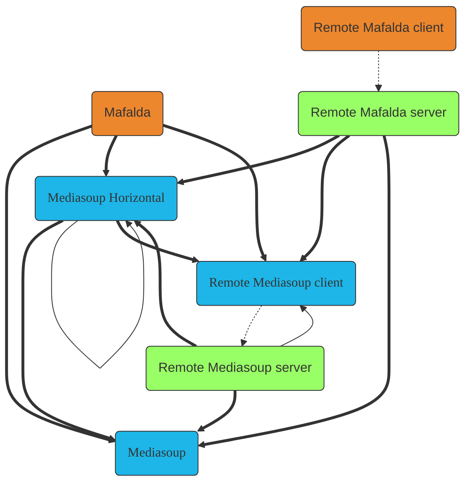
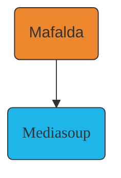
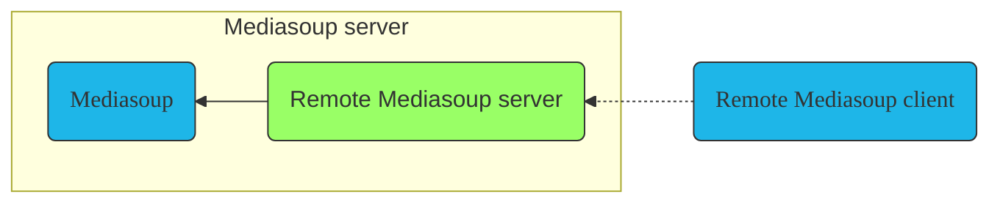
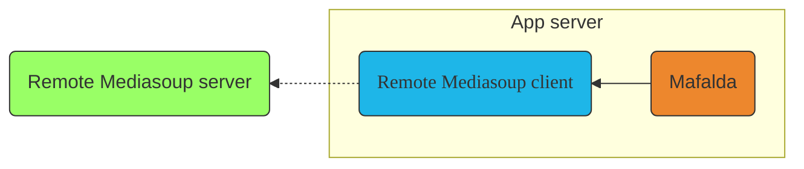
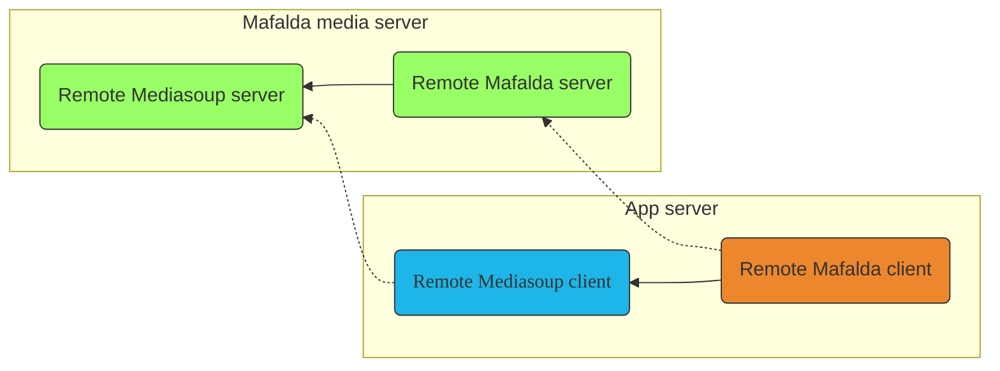
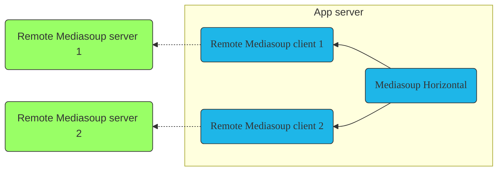
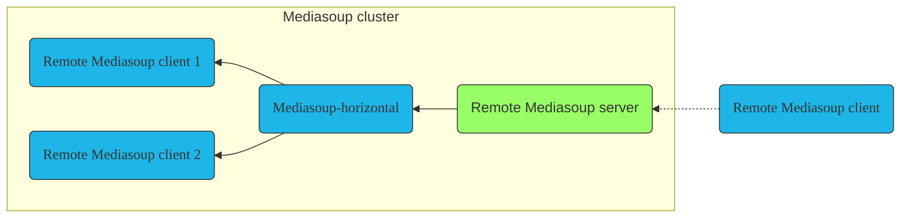
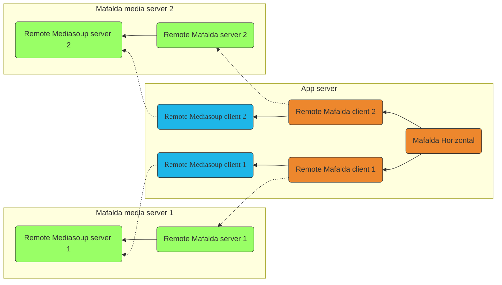

# Mafalda projects

- [Mafalda](Mafalda): Mediasoup vertical scalability, allow to have Router
  objects that by-pass Mediasoup per-Worker limits.
- [Remote Mediasoup server](Remote-Mediasoup-server) &
  [Remote Mediasoup client](Remote-Mediasoup-client): remote control of
  Mediasoup instances, both of them build on top of [ROPE server](ROPE-server) &
  [ROPE client](ROPE-client).
- [Remote Mafalda server](Remote-Mafalda-server) &
  [Remote Mafalda client](Remote-Mafalda-client): remote control of Mafalda
  instances.
- [Mediasoup-horizontal](Mediasoup-horizontal): Mediasoup horizontal
  scalability, allow to use Mediasoup Worker instances located on multiple
  servers from a single place as if they were local to it.
- [Mafalda-horizontal](Mafalda-horizontal): Mafalda horizontal scalability,
  allow to have Router objects that transparently span over multiple servers and
  CPUs.
  *Currently in development*
- *Mafalda-swarm*: Decentralized horizontal scaling for Mafalda, allow to access
  streams from multiple entry points without a central management, based on P2P
  technologies and architecture. *Estimated June 2023*
- *Mafalda-monitor*: Mafalda network monitoring tool, allow to control stats and
  loads of the servers in the network and their connected clients.
  *Estimated December 2023*

Since all packages have by design an orthogonal API, it's possible to combine
them in a mix-n-match way to create the best fit for your use case. The next
diagram shows all the possible combinations:

Thick lines represent main connections, thin lines are compatible ones but their
usage is not recommended. Dotted lines are client-server network connections.

## Auxiliary packages

- [ROPE server](ROPE-server) & [ROPE client](ROPE-client): canonical
  implementations of the *Remote Objects, Procedures and Events* protocol, that
  allow remote control of objects located as if they were local, including
  sync'ed updates of remote state, also when multiple clients are involved.
- [Mediasoup-cluster](Mediasoup-cluster): standalone server using
  [Mediasoup-horizontal](Mediasoup-horizontal) to control multiple Remote
  Mediasoup servers from a single endpoint.

## What package should I use?

Mafalda modular design allows you to use the packages that better fit for your
use case, and easily upgrade to other ones when you need it. To help you to
decide were to start, we've defined here some use cases:

### I'm writting a new server

If you are writting a new server from scratch, the best option is to start with
[Mafalda](Mafalda) package. This one will allow you not only to abstract from
creating and managing yourself the usage of multiple Mediasoup Workers, but also
to load balance the creation of Mediasoup Routers on them, or pipe and join the
Router instances between them to by-pass Mediasoup per-Worker limits.

### I'm using only non-interconnected Router instances that I need them to scale

If you already have an app server using Mediasoup Routers and until now you
didn't need to interconnect them to by-pass Mediasoup per-Worker limits, it
would pay-off the efforts of migrate your Mediasoup code to use Mafalda instead.
Mafalda API and design is based on Mediasoup one, so migration should be easy to
do, and you would enjoy all the advantages of scalability and abstracted
management that Mafalda provides, without almost needing to change your
application logic nor worrying about managing them yourself.

In addition to that, by using Mafalda will prepare your code to later upgrade to
use [Mafalda-horizontal](Mafalda-horizontal) and scale your app to multiple
servers too.

### I have mixed app logic and media, that want to split to improve architecture

If your app server code directly access Mediasoup API, and need to move it out
to another machine to improve your systems architecture, or to use a server with
more resources to increase media performance, the easiest solution is to use
[Remote Mediasoup](Remote-Mediasoup) package. After creating and configuring a
Remote Mediasoup client, it will expose an object with the same API that
Mediasoup provides, so your you'll be able to control a Mediasoup instance
running in another server without needing to modify the logic of your app code
at all.

Alternatively, you can also use [Mediasoup-horizontal](Mediasoup-horizontal),
that will already prepare your application to scale to multiple servers without
changes, or use the same Remote Mediasoup client instance to connect instead to
a [Mediasoup-cluster](Mediasoup-cluster) server.

### I'm using Mafalda, and want to move out media server to improve performance

If you are already using Mafalda in a monolithic server, you can split your code
by moving out the media logic to another server as you would do with any other
Mediasoup based server by using [Remote Mediasoup](Remote-Mediasoup) and improve
your performance by having a dedicated media server, or make use of
[Remote Mafalda](Remote-Mafalda) package for additional beneficts, like manage
abstract remote Mafalda Router instances. Similar to Remote Mediasoup, you'll be
able to control a Mafalda instance running in another server, and prepare your
code to upgrade later to use [Mafalda-horizontal](Mafalda-horizontal) and allow
each one of your sessions to grow and span over multiple CPUs and servers.

### My app uses Mediasoup, and I need to scale it to a large number of servers

If you need your Mediasoup-based app to being able to manage multiple media
servers, your solutions are to use [Mediasoup-horizontal](Mediasoup-horizontal)
if you want your app process to control them directly, or use
[Mediasoup-cluster](Mediasoup-cluster) if you want to move the management of the
multiple media servers from your actual app server. Both of them will allows you
to control multiple Mediasoup instances as a single one (only difference is
where's the management is efectively being done), and to have both remote
Workers and Routers all over them in a transparent way, as if running a single
machine with lots of CPU cores.

### I need to host huge sessions that will span several CPUs in multiple servers

If your sessions can be potentially big and exceed the capability that can offer
a single server, [Mafalda-horizontal](Mafalda-horizontal) will help here. It
will automatically create, manage and interconnect the Router instances on the
different servers while providing the same API of Mafalda, so you'll only need
to worry about using it in your app code as if you only would need a single
Router local instance.

*Currently in development*

### I host humongous big sessions, and need to access them from multiple places

If your sessions can be *really* big or can't be predicted when that usage
spikes could happen or can be a lot of difference in sessions load from ones to
other, if the number of servers you need to manage is huge or you can't easily
control when or how to add them, if you need that stream distribution auto
regulates itself finding the shortest path, or if you need to access the servers
network from multiple entry points (for example, from multiple regions), then
*now we're talking*.

[Mafalda-swarm]() will provide a federated and decentralized P2P architecture
build on top of the Mafalda network, self-managing its resources and allowing
access to it from any of their nodes by providing a search mechanism of the
streams.

*Estimated June 2023*

### I need to monitor the stats, loads and connections of all my Mafalda servers

Not directly related to solve scalability problem, but scalability-derived ones,
[Mafalda-monitor]() allows to control and monitor from a single place the
activity of all your Remote Mafalda servers and their network clients. With it,
you can have a real-time graphical view of the number of their Workers and
Routers, their CPU loads, their Transports, how are they inter-connected...

*Estimated December 2023*
