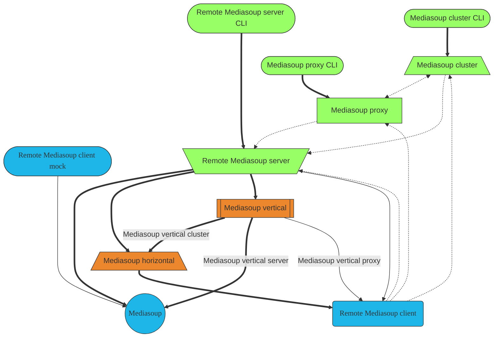

All Mafalda SFU packages have by design an orthogonal API, making it possible to
combine them in a mix-n-match way to create the best fit for your use case. The
next diagram shows all the possible combinations:

Thick lines represent main usage relationships, thin lines are compatible ones
but their usage is not promoted. Dotted lines are client-server network
connections.

## Main projects

- [Mafalda](/Mafalda): Mediasoup vertical scalability, allow to have Router
  objects that by-pass Mediasoup per-Worker limits.
- [Remote Mediasoup server](/Remote-Mediasoup-server) &
  [Remote Mediasoup client](/Remote-Mediasoup-client): remote control of
  Mediasoup instances, both of them build on top of [ROPE server](/ROPE-server)
  & [ROPE client](/ROPE-client).
- [Mediasoup-cluster CLI](/Mediasoup-cluster-CLI): standalone server using
  [Mediasoup-horizontal](/Mediasoup-horizontal) to control multiple Remote
  Mediasoup servers from a single endpoint.

- *Mafalda-swarm*: Decentralized horizontal scaling for Mafalda, allow to access
  streams from multiple entry points without a central management, based on P2P
  technologies and architecture. *Estimated August 2023*

## Auxiliary packages

- [Remote Mafalda server](/Remote-Mafalda-server) &
  [Remote Mafalda client](/Remote-Mafalda-client): remote control of Mafalda
  instances.
- [Mediasoup-horizontal](/Mediasoup-horizontal): Mediasoup horizontal
  scalability, allow to use Mediasoup Worker instances located on multiple
  servers from a single place as if they were local to it.
- [ROPE server](/ROPE-server) & [ROPE client](/ROPE-client): canonical
  implementations of the *Remote Objects, Procedures and Events* protocol, that
  allow remote control of objects located as if they were local, including
  sync'ed updates of remote state, also when multiple clients are involved.

- *Mafalda-monitor*: Mafalda network monitoring tool, allow to control stats and
  loads of the servers in the network and their connected clients.
  *Estimated December 2023*

## Related pages

- [What package should I use?](/what-package-should-I-use/)

## Mafalda SFU ❤️ Open Source

Mafalda SFU is build on top of multiple Open Source projects, being
[Mediasoup](https://mediasoup.org/) the most prominent one. In addition to that,
during development of Mafalda SFU we have created and published multiple
auxiliary Open Source projects and contributed to several others, between
dependencies, tools, demos, reporters, forks... You can find a list of all of
them at [Mafalda SFU Github organization](https://github.com/Mafalda-SFU), and
at [Mafalda SFU NPM organization](https://www.npmjs.com/org/mafalda-sfu).
