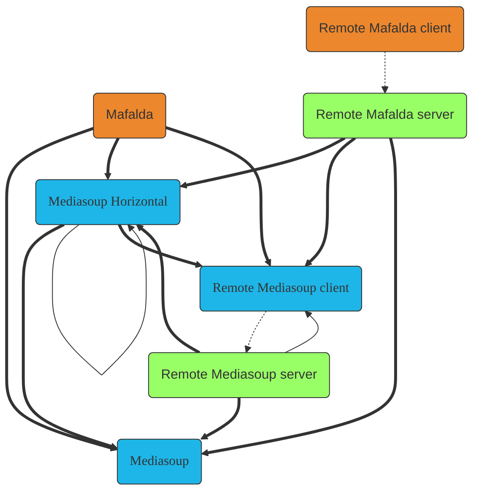

- [Mafalda](/Mafalda): Mediasoup vertical scalability, allow to have Router
  objects that by-pass Mediasoup per-Worker limits.
- [Remote Mediasoup server](/Remote-Mediasoup-server) &
  [Remote Mediasoup client](/Remote-Mediasoup-client): remote control of
  Mediasoup instances, both of them build on top of [ROPE server](/ROPE-server)
  & [ROPE client](/ROPE-client).
- [Remote Mafalda server](/Remote-Mafalda-server) &
  [Remote Mafalda client](/Remote-Mafalda-client): remote control of Mafalda
  instances.
- [Mediasoup-horizontal](/Mediasoup-horizontal): Mediasoup horizontal
  scalability, allow to use Mediasoup Worker instances located on multiple
  servers from a single place as if they were local to it.
- [Mafalda-horizontal](/Mafalda-horizontal): Mafalda horizontal scalability,
  allow to have Router objects that transparently span over multiple servers and
  CPUs.
  *Currently in development*
- *Mafalda-swarm*: Decentralized horizontal scaling for Mafalda, allow to access
  streams from multiple entry points without a central management, based on P2P
  technologies and architecture. *Estimated August 2023*
- *Mafalda-monitor*: Mafalda network monitoring tool, allow to control stats and
  loads of the servers in the network and their connected clients.
  *Estimated December 2023*

Since all packages have by design an orthogonal API, it's possible to combine
them in a mix-n-match way to create the best fit for your use case. The next
diagram shows all the possible combinations:

Thick lines represent main connections, thin lines are compatible ones but their
usage is not recommended. Dotted lines are client-server network connections.

## Auxiliary packages

- [ROPE server](/ROPE-server) & [ROPE client](/ROPE-client): canonical
  implementations of the *Remote Objects, Procedures and Events* protocol, that
  allow remote control of objects located as if they were local, including
  sync'ed updates of remote state, also when multiple clients are involved.
- [Mediasoup-cluster](/Mediasoup-cluster): standalone server using
  [Mediasoup-horizontal](/Mediasoup-horizontal) to control multiple Remote
  Mediasoup servers from a single endpoint.

## Related pages

- [What package should I use?](/what-package-should-I-use/)
