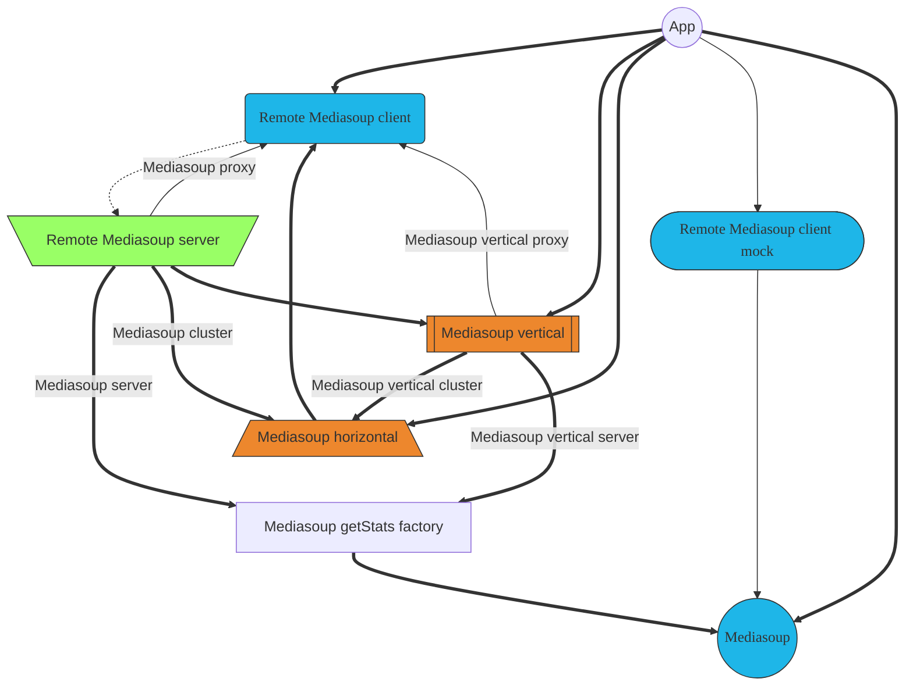

All Mafalda SFU packages have by design an orthogonal API, making it possible to
combine them in a *mix-n-match* way to create the best fit for your use case.
Next diagram shows all possible low-level combinations, and the projects
implementing their high-level relationships:



Thick lines represent main usage relationships, thin lines are compatible ones
but their usage is not promoted. Dotted line are client-server networked
connections. Elements with blue color provides a Mediasoup compatible API,
elements with green color provides Remote Mediasoup compatible API, and elements with orange color are Mafalda SFU specific internal components.

## Main projects

- [Remote Mediasoup server](/Remote-Mediasoup-server) &
  [Remote Mediasoup client](/Remote-Mediasoup-client): remote control of
  Mediasoup instances, both of them build on top of [ROPE server](/ROPE-server)
  & [ROPE client](/ROPE-client).

  ```mermaid
  graph TD
    remoteMediasoupServerCLI([Remote Mediasoup server CLI])

    subgraph Mediasoup-server
      remoteMediasoupServer[\Remote Mediasoup server/]
      mediasoupGetStatsFactory[Mediasoup getStats factory]
      mediasoup((Mediasoup))

      remoteMediasoupServer ==> mediasoupGetStatsFactory
      mediasoupGetStatsFactory ==> mediasoup

      class mediasoup mediasoupAPI
      class remoteMediasoupServer remoteMediasoupAPI
    end

    remoteMediasoupServerCLI ==> Mediasoup-server


    classDef mediasoupAPI       fill:#1eb6e8,stroke:#333,font-family:PoiretOne
    classDef remoteMediasoupAPI fill:#9f6,stroke:#333

    class remoteMediasoupServerCLI remoteMediasoupAPI

    click remoteMediasoupServerCLI "/Remote-Mediasoup-server-CLI"
  ```

- [Mediasoup-proxy CLI](/Mediasoup-proxy-CLI): standalone server using
  [Mediasoup-proxy](/Mediasoup-proxy) to control a Remote Mediasoup server from
  another endpoint.

  ```mermaid
  graph TD
    mediasoupProxyCLI([Mediasoup proxy CLI])

    subgraph Mediasoup-proxy
      mediasoupProxy_remoteMediasoupServer[\Remote Mediasoup server/]
      mediasoupProxy_remoteMediasoupClient(Remote Mediasoup client)

      mediasoupProxy_remoteMediasoupServer ==> mediasoupProxy_remoteMediasoupClient

      class mediasoupProxy_remoteMediasoupClient mediasoupAPI
      class mediasoupProxy_remoteMediasoupServer remoteMediasoupAPI
    end


    mediasoupProxyCLI ==> Mediasoup-proxy


    classDef mediasoupAPI       fill:#1eb6e8,stroke:#333,font-family:PoiretOne
    classDef remoteMediasoupAPI fill:#9f6,stroke:#333

    class mediasoupProxyCLI remoteMediasoupAPI

    click mediasoupProxyCLI "/Mediasoup-proxy-CLI"
  ```

- [Mediasoup-cluster CLI](/Mediasoup-cluster-CLI): standalone server using
  [Mediasoup-horizontal](/Mediasoup-horizontal) to control multiple Remote
  Mediasoup servers from a single endpoint, providing support for
  *horizontal scalability*.

  ```mermaid
  graph TD
    mediasoupClusterCLI([Mediasoup cluster CLI])

    subgraph Mediasoup-cluster
      mediasoupCluster_remoteMediasoupServer[\Remote Mediasoup server/]
      mediasoupCluster_mediasoupHorizontal[/Mediasoup horizontal\]

      mediasoupCluster_remoteMediasoupClient1(Remote Mediasoup client)
      mediasoupCluster_remoteMediasoupClient2(Remote Mediasoup client)

      mediasoupCluster_remoteMediasoupServer ==> mediasoupCluster_mediasoupHorizontal

      mediasoupCluster_mediasoupHorizontal ==> mediasoupCluster_remoteMediasoupClient1
      mediasoupCluster_mediasoupHorizontal ==> mediasoupCluster_remoteMediasoupClient2

      class mediasoupCluster_mediasoupHorizontal mafaldaApi
      class mediasoupCluster_remoteMediasoupClient1,mediasoupCluster_remoteMediasoupClient2 mediasoupAPI
      class mediasoupCluster_remoteMediasoupServer remoteMediasoupAPI
    end


    mediasoupClusterCLI ==> Mediasoup-cluster


    classDef mafaldaApi         fill:#ED872D,stroke:#333
    classDef mediasoupAPI       fill:#1eb6e8,stroke:#333,font-family:PoiretOne
    classDef remoteMediasoupAPI fill:#9f6,stroke:#333

    class mediasoupClusterCLI remoteMediasoupAPI

    click mediasoupClusterCLI "/Mediasoup-cluster-CLI"
  ```

- [Mediasoup-vertical-server](/Mediasoup-vertical-server) and
  [Mediasoup-vertical-proxy](/Mediasoup-vertical-proxy): implementations of
  [Mediasoup-server](/Mediasoup-server) and [Mediasoup-proxy](/Mediasoup-proxy)
  with integrated support for [Mediasoup-vertical](/Mediasoup-vertical),
  unifying all server resources providing *vertical scalability* for them.

  ```mermaid
  graph TD
    remoteMediasoupServerCLI([Remote Mediasoup server CLI])

    subgraph Mediasoup-vertical-server
      remoteMediasoupServer[\Remote Mediasoup server/]
      mediasoupVertical[[Mediasoup vertical]]
      mediasoupGetStatsFactory[Mediasoup getStats factory]
      mediasoup((Mediasoup))

      remoteMediasoupServer ==> mediasoupVertical
      mediasoupVertical ==> mediasoupGetStatsFactory
      mediasoupGetStatsFactory ==> mediasoup

      class mediasoup mediasoupAPI
      class mediasoupVertical mafaldaApi
      class remoteMediasoupServer remoteMediasoupAPI
    end

    remoteMediasoupServerCLI ==> Mediasoup-vertical-server


    classDef mediasoupAPI       fill:#1eb6e8,stroke:#333,font-family:PoiretOne
    classDef remoteMediasoupAPI fill:#9f6,stroke:#333

    classDef mafaldaApi         fill:#ED872D,stroke:#333
    class remoteMediasoupServerCLI remoteMediasoupAPI

    click remoteMediasoupServerCLI "/Remote-Mediasoup-server-CLI"
  ```

  ```mermaid
  graph TD
    mediasoupVerticalProxyCLI([Mediasoup vertical proxy CLI])

    subgraph Mediasoup-vertical-proxy
      remoteMediasoupServer[\Remote Mediasoup server/]
      mediasoupVertical[[Mediasoup vertical]]
      remoteMediasoupClient(Remote Mediasoup client)

      remoteMediasoupServer ==> mediasoupVertical
      mediasoupVertical ==> remoteMediasoupClient

      class mediasoupVertical mafaldaApi
      class remoteMediasoupClient mediasoupAPI
      class remoteMediasoupServer remoteMediasoupAPI
    end


    mediasoupVerticalProxyCLI ==> Mediasoup-vertical-proxy


    classDef mafaldaApi         fill:#ED872D,stroke:#333
    classDef mediasoupAPI       fill:#1eb6e8,stroke:#333,font-family:PoiretOne
    classDef remoteMediasoupAPI fill:#9f6,stroke:#333

    class mediasoupVerticalProxyCLI remoteMediasoupAPI

    click mediasoupVerticalProxyCLI "/Mediasoup-proxy-CLI"
  ```

- [Mediasoup-vertical-cluster CLI](/Mediasoup-vertical-cluster-CLI): standalone
  server using [Mediasoup-vertical](/Mediasoup-vertical) on top of
  [Mediasoup-horizontal](/Mediasoup-horizontal), implementing
  *aggregated scalability*. This project is the flagship package of
  `Mafalda SFU`.

  ```mermaid
  graph TD
    mediasoupVerticalClusterCLI([Mediasoup vertical cluster CLI])

    subgraph Mediasoup-vertical-cluster
      remoteMediasoupServer[\Remote Mediasoup server/]
      mediasoupVertical[[Mediasoup vertical]]
      mediasoupHorizontal[/Mediasoup horizontal\]

      remoteMediasoupClient1(Remote Mediasoup client)
      remoteMediasoupClient2(Remote Mediasoup client)

      remoteMediasoupServer ==> mediasoupVertical
      mediasoupVertical ==> mediasoupHorizontal

      mediasoupHorizontal ==> remoteMediasoupClient1
      mediasoupHorizontal ==> remoteMediasoupClient2

      class mediasoupHorizontal,mediasoupVertical mafaldaApi
      class remoteMediasoupClient1,remoteMediasoupClient2 mediasoupAPI
      class remoteMediasoupServer remoteMediasoupAPI
    end


    mediasoupVerticalClusterCLI ==> Mediasoup-vertical-cluster


    classDef mafaldaApi         fill:#ED872D,stroke:#333
    classDef mediasoupAPI       fill:#1eb6e8,stroke:#333,font-family:PoiretOne
    classDef remoteMediasoupAPI fill:#9f6,stroke:#333

    class mediasoupVerticalClusterCLI remoteMediasoupAPI

    click mediasoupVerticalClusterCLI "/Mediasoup-cluster-CLI"
  ```

## Auxiliary packages

- [Mediasoup-vertical](/Mediasoup-vertical): Mediasoup vertical scalability,
  allow to have Router objects that by-pass Mediasoup per-Worker limits.
- [Mediasoup-horizontal](/Mediasoup-horizontal): Mediasoup horizontal
  scalability, allow to use Mediasoup Worker instances located on multiple
  servers from a single place as if they were local to it.
- [ROPE server](/ROPE-server) & [ROPE client](/ROPE-client): canonical
  implementations of the *Remote Objects, Procedures and Events* protocol, that
  allow remote control of objects located as if they were local, including
  sync'ed updates of remote state, also when multiple clients are involved.

### Future projects

- *Mafalda-monitor*: Mafalda SFU network monitoring tool, allow to control
  stats and loads of the servers in the network and their connected clients.
- *Mafalda-swarm*: Decentralized horizontal scaling for Mafalda SFU, allow to
  access streams from multiple entry points without a central management, based
  on P2P technologies and architecture.

## Related pages

- [What package should I use?](/what-package-should-I-use/)
- [Projects dashboard](/dashboard/)
